# :pencil2: pqLAB

[](https://doi.org/10.5281/zenodo.19688111)

O pqLAB é uma ferramenta web de organização de pesquisa qualitativa que centraliza em uma única interface seis instrumentos de trabalho acadêmico: diário de campo, listas, tarefas, favoritos, fichamentos e planos de curso, todos conectados por [[links internos]] navegáveis. Os dados são armazenados diretamente no repositório GitHub privado do próprio usuário, sem servidor intermediário, e uma visualização em grafo revela automaticamente as conexões temáticas entre o material registrado, formando um mapa mental, capaz de fornecer *insights* sobre sua própria investigação.

O software foi desenvolvido por [Viktor Chagas](https://scholar.google.com/citations?user=F02DKoAAAAAJ&hl=en) e pelo [coLAB/UFF](http://colab-uff.github.io), com auxílio do Claude Code Sonnet 4.6 para as tarefas de programação. Os autores agradecem a Rafael Cardoso Sampaio pelos comentários e sugestões de adoção de ferramentas de IA, que levaram ao planejamento inicial da aplicação.

# :octocat: Frameworks

O pqLAB foi desenvolvido em TypeScript com React 19 como framework de interface, utilizando Vite 7 como bundler e servidor de desenvolvimento. A estilização é feita com Tailwind CSS v4 (via plugin oficial para Vite). Para roteamento foi utilizado React Router v7 com rotas aninhadas, e o gerenciamento de dados assíncronos é feito com TanStack Query v5. Os componentes de interface seguem o padrão shadcn/ui, construídos sobre primitivos Radix UI com utilitários cva, clsx e tailwind-merge. Recursos adicionais incluem @hello-pangea/dnd para drag-and-drop no kanban, Recharts para gráficos, jsPDF + jspdf-autotable para exportação em PDF, xlsx para planilhas e js-yaml para serialização dos dados e SVG puro para o grafo, além de opcionalmente integrar com Firebase.

Toda a persistência de dados ocorre diretamente no repositório GitHub do usuário por meio da GitHub Contents API (REST), sem banco de dados externo. Os dados são armazenados em arquivos YAML e anexos em base64, organizados por entidade no repositório. O projeto não depende de nenhum serviço de backend próprio — o navegador se comunica diretamente com as APIs do GitHub e do Firebase.

---

## :gem: Módulos

### 1. Diário de Campo

Registre, em entradas cronológicas, como um diário de campo, os principais encontros e acontecimentos relacionados à sua pesquisa. O módulo permite documentar momentos importantes de sua investigação, criando [[links internos]] para associar episódios ou sujeitos, e etiquetas para classificar temas. O compilado de todos os registros ou as entradas do diário individualmente podem ser exportados em diferentes formatos e o usuário pode ainda favoritar suas anotações mais importantes.

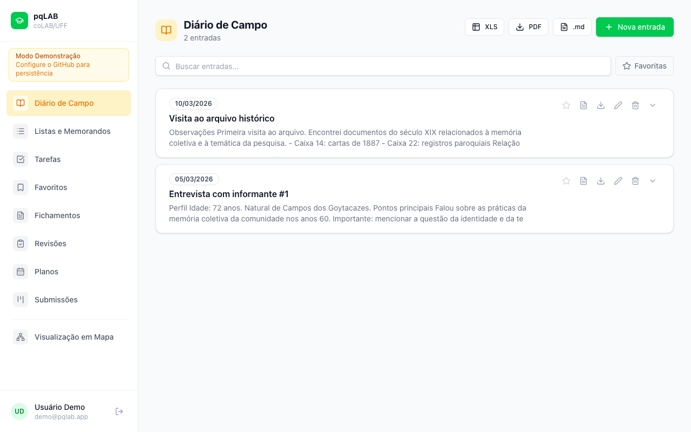

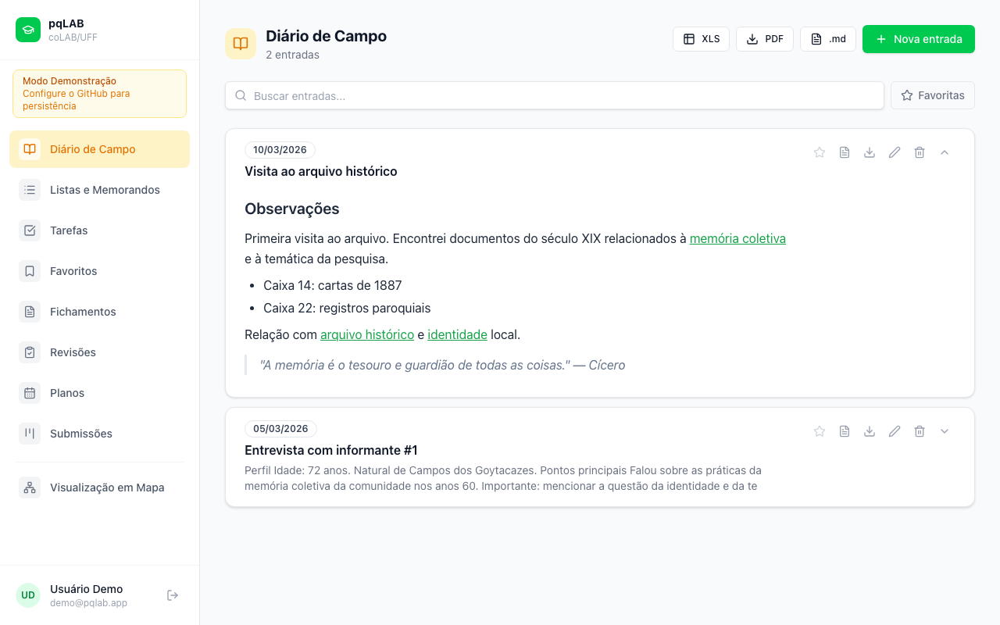


### 2. Listas e Memorandos

Organize listas e memorandos livremente. Se sua pesquisa é ancorada em fichas ou anotações de campo esparsas, que funcionam como memorandos, conforme o jargão empregado na *Grounded Theory*, este módulo pode lhe ajudar a dar conta de visualizar padrões e reconhecer tendências de forma exploratória. Também permite organizar um sumário de capítulos para seu livro, tese ou dissertação.

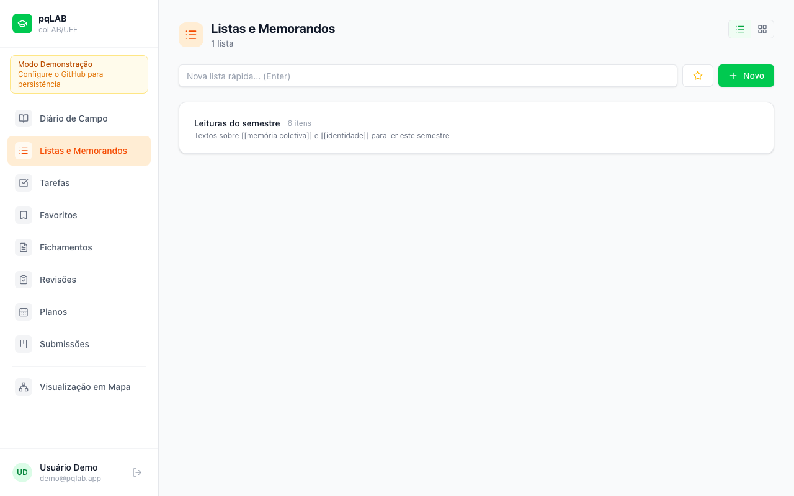

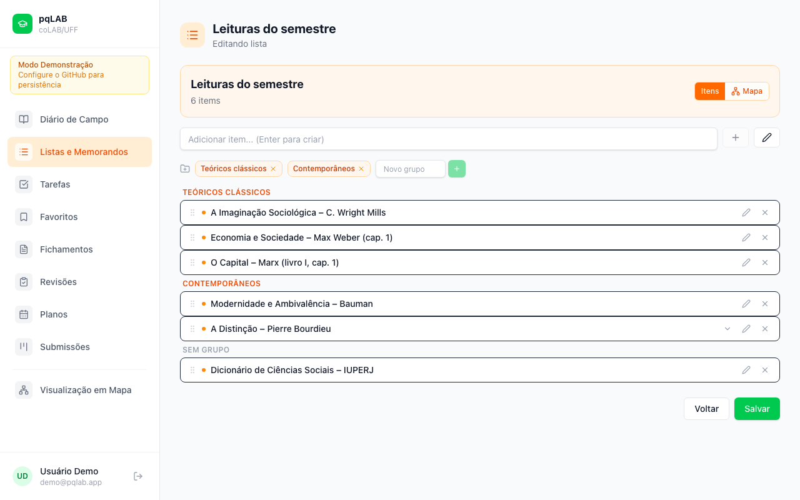


### 3. Tarefas

Gerencie as principais tarefas relacionadas à sua pesquisa, incluindo metas abrangentes, compromissos específicos e prazos. O módulo apresenta ainda uma visualização para acompanhamento do progresso de suas atividades.

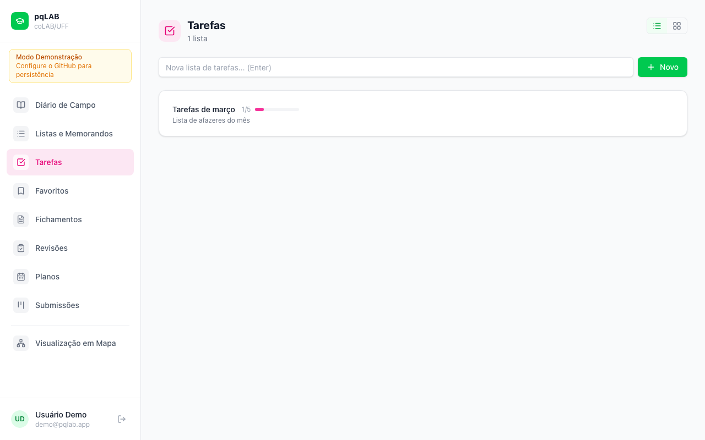

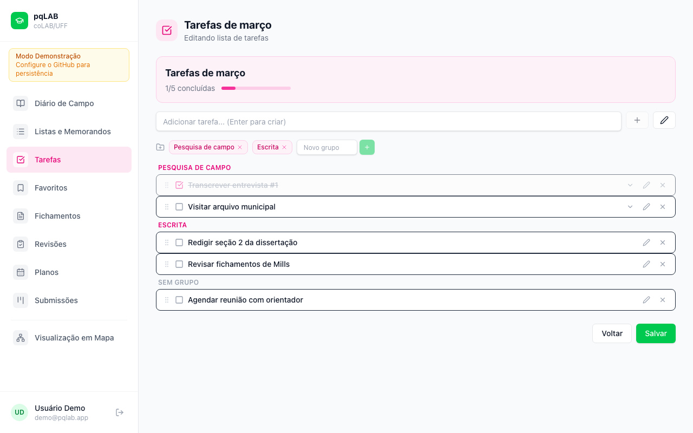


### 4. Favoritos

Guarde links, artigos e documentos em arquivos importantes, salvando todos os favoritos de sua pesquisa em um só local. O módulo permite trabalhar tanto com URLs quanto com arquivos como PDF, ePUB e DOC, importando automaticamente os metadados dos documentos anexados. Há ainda opção para assinar o feed RSS de blogs e portais importantes para sua pesquisa.

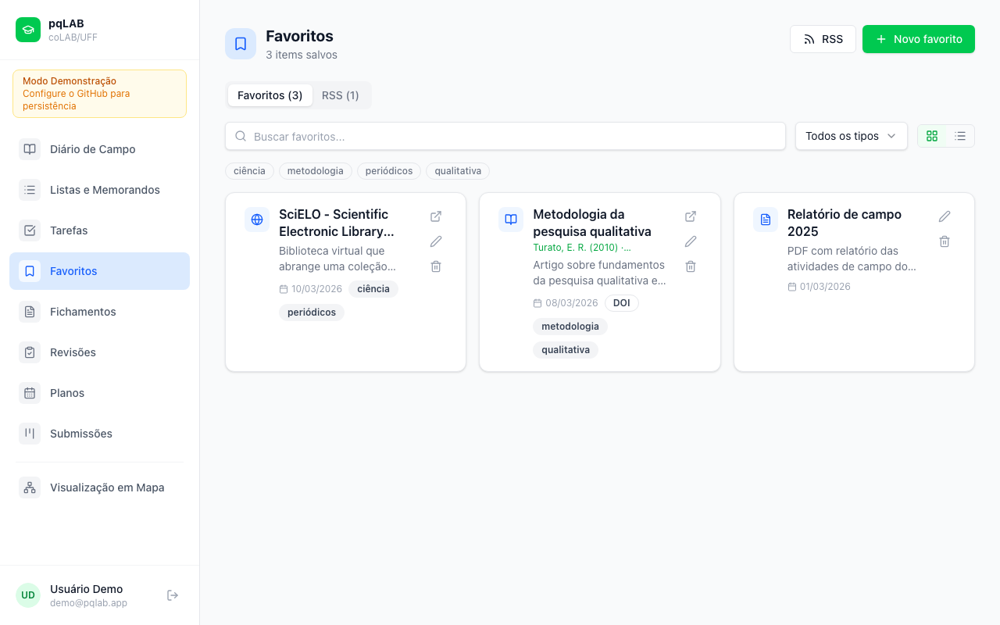

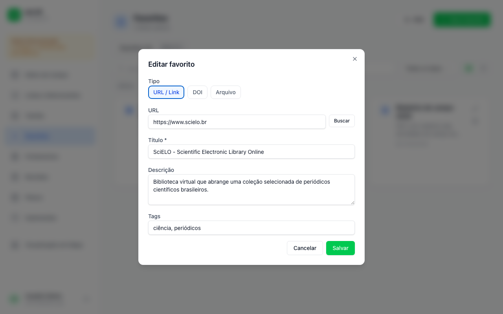


### 5. Fichamentos

Construa fichamentos sobre referências bibliográficas e leituras importantes para sua pesquisa. O módulo organiza e documenta suas leituras em diferentes padrões de normatização (ABNT/APA) e permite ainda inserir comentários e citações página a página, além de facilitar a exportação do fichamento em diferentes formatos de arquivo.

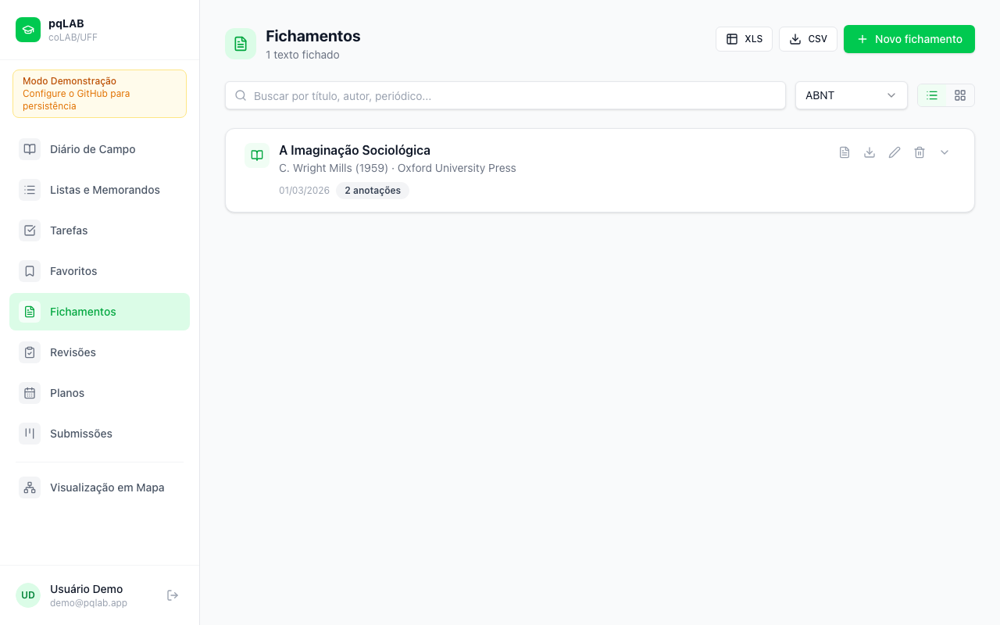

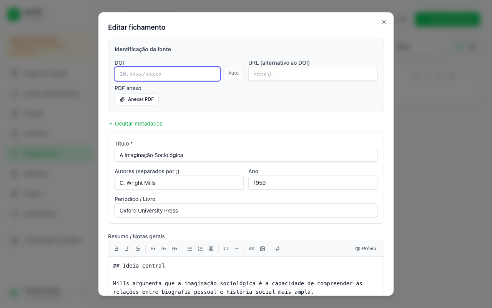


### 6. Planos

Cadastre planos de trabalho ou programas de disciplinas, associando a descrição de atividades e recomendações de leitura a datas específicas e organizando por temas, em um sistema simples de *drag and drop*. Os planos podem ser ainda exportados em diferentes formatos para fácil compartilhamento.

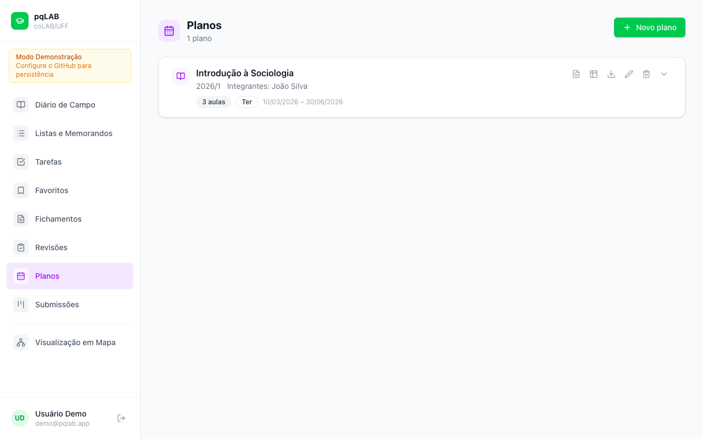

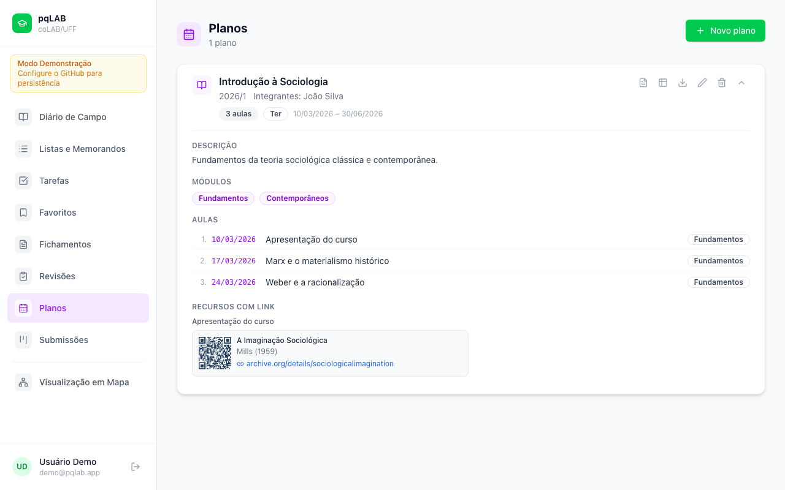


### 7. Submissões

Gerencie o ciclo de vida dos artigos submetidos a periódicos e congressos em um quadro Kanban com cinco colunas: Purgatório, Resumo ou Draft, Queue, Em Avaliação e Aguardando Publicação. Cada submissão pode ter autores, resumo e um log cronológico de eventos (submissões, rodadas de revisão, aceites e recusas) registrado na forma de uma linha do tempo.

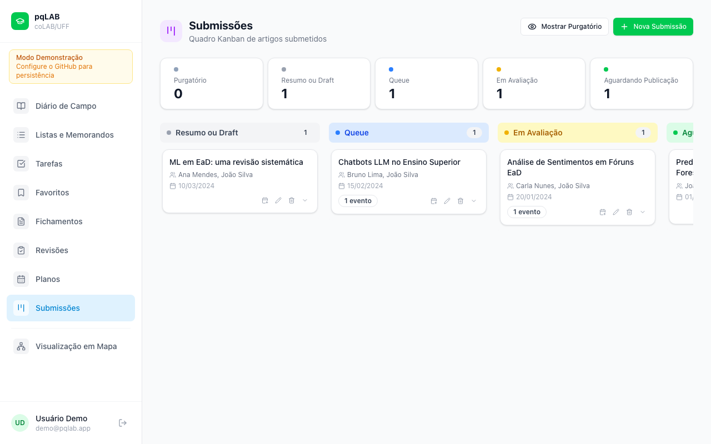

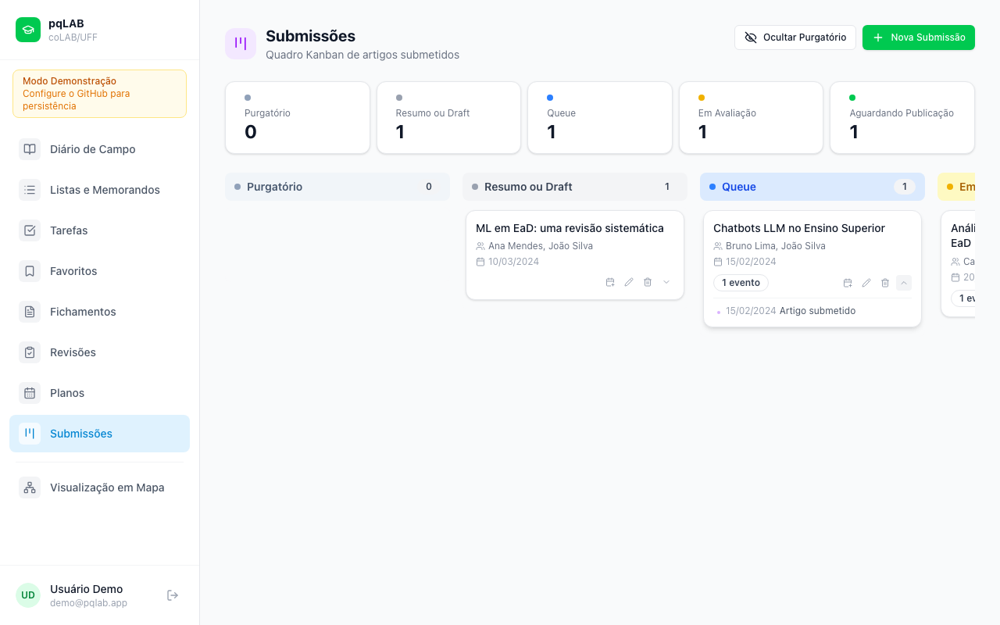


### 8. Visualização em Mapa

Acompanhe e visualize as associações construídas a partir de [[links internos]] nas suas anotações de diário de campo, tarefas, fichamentos e outros módulos em um mapa mental interativo, produzido a partir de um grafo *force-directed* gerado automaticamente com os dados providos pelos módulos.

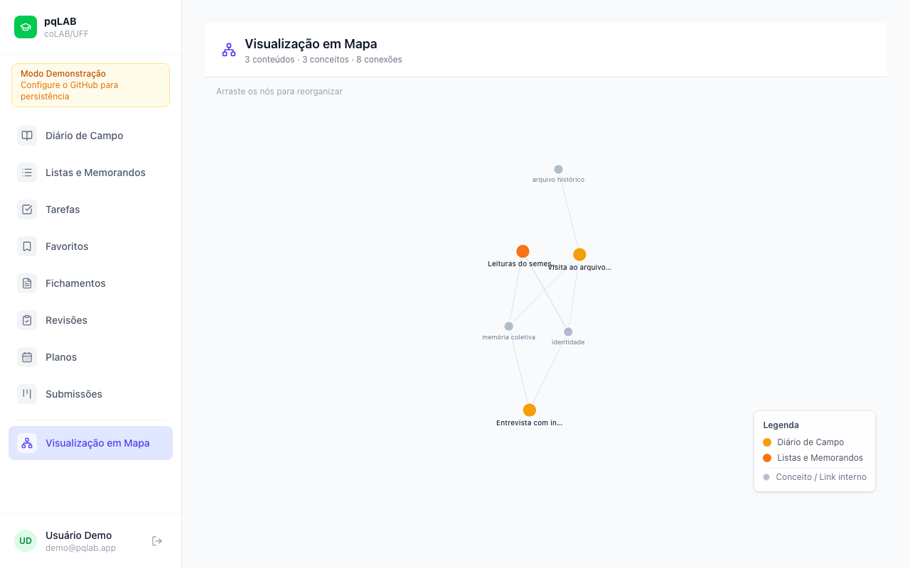

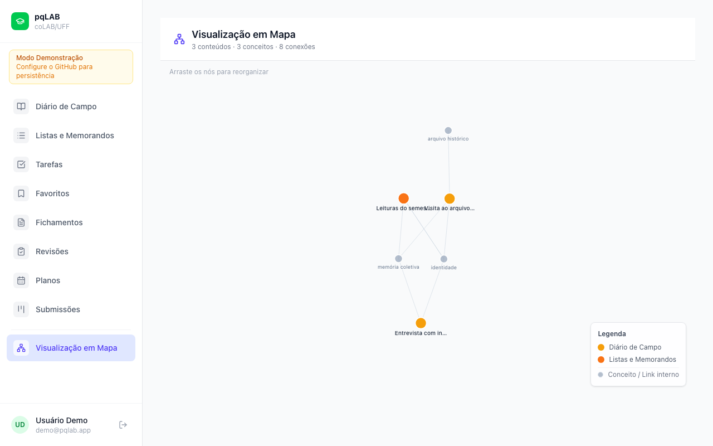


---

# 🚀 Instalação do pqLAB — Passo a passo

> Toda a configuração é feita pelo navegador e pela interface do GitHub.
> Nenhum terminal, nenhum build local — o GitHub cuida de tudo automaticamente.

## Passo 1 — Fork do repositório

1. Acesse **github.com/ombudsmanviktor/pqlab**
2. Clique em **Fork** (canto superior direito)
3. Escolha sua conta como destino e confirme

Você terá uma cópia em `github.com/SEU-USUARIO/pqlab`.

---

## Passo 2 — Ativar o GitHub Pages

1. No seu fork, acesse **Settings → Pages**
2. Em **Source**, selecione **GitHub Actions**
3. Salve

O GitHub irá executar o workflow automaticamente e publicar o app. Aguarde cerca de 1–2 minutos e acesse:

```
https://SEU-USUARIO.github.io/pqlab
```

> Você pode acompanhar o progresso em **Actions** → workflow "Build e deploy no GitHub Pages".

---

## Passo 3 — Criar o repositório de dados

O pqLAB armazena seus dados em YAML num repositório GitHub **privado** de sua propriedade.

1. Acesse **github.com → New repository**
2. Deixe o repositório **privado**
3. Marque **"Add a README file"** (para inicializar o branch `main`)
4. Anote o nome do repositório criado

---

## Passo 4 — Gerar um Personal Access Token (PAT)

1. Acesse **github.com → Settings → Developer settings → Personal access tokens → Tokens (classic)**
2. Clique em **Generate new token (classic)**
3. Selecione o escopo **`repo`**
4. Clique em **Generate token** e copie o valor (`ghp_...`)

> ⚠️ O token é exibido apenas uma vez. Guarde-o em local seguro.

---

## Passo 5 — Configurar o login

Acesse `https://SEU-USUARIO.github.io/pqlab` e preencha:

- **Personal Access Token** — o valor copiado no Passo 4
- **Usuário / Org** — seu nome de usuário no GitHub
- **Repositório** — nome do repositório criado no Passo 3
- **Branch** — `main` (padrão)

Clique em **Conectar e entrar**.

---

## Login com Google (opcional)

Para habilitar o login com Google, edite o arquivo `public/config.json` no seu fork e preencha os campos do bloco `firebase` com as credenciais do seu projeto Firebase. O commit acionará um novo deploy automaticamente.

Deixe os campos em branco para usar apenas o modo PAT — o app funciona normalmente sem Firebase.

---

## Instalação local (desenvolvimento)

Se preferir rodar o app localmente:

```bash
git clone https://github.com/SEU-USUARIO/pqlab.git
cd pqlab
npm install
npm run dev        # http://localhost:5173
```

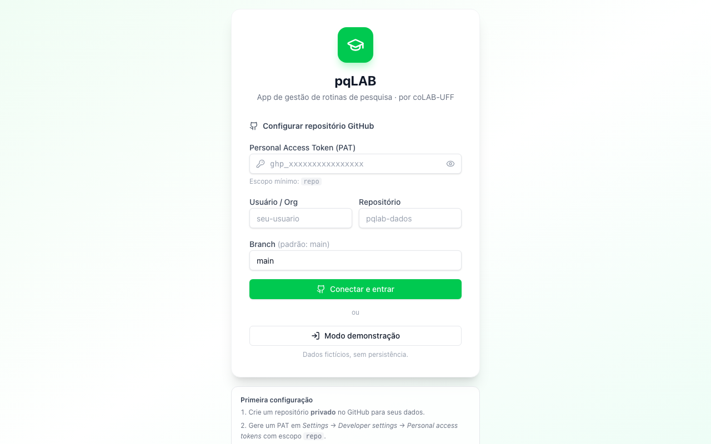


## Estrutura de dados criada automaticamente

```
meus-dados-pq/
│
├── data/
│   ├── diario/
│   │   ├── {uuid}.yaml        ← uma entrada por arquivo
│   │   └── {uuid}.yaml
│   │
│   ├── bookmarks/
│   │   └── {uuid}.yaml
│   │
│   ├── rssfeeds/
│   │   └── {uuid}.yaml
│   │
│   ├── fichamentos/
│   │   └── {uuid}.yaml
│   │
│   ├── planos/
│   │   └── {uuid}.yaml
│   │
│   ├── listas/                ← Tarefas (com checkbox)
│   │   └── {uuid}.yaml
│   │
│   └── listassimples/         ← Listas e Memorandos (sem checkbox)
│       └── {uuid}.yaml
│
└── attachments/
    ├── diario/{id}/{arquivo}   ← PDFs, imagens etc. por módulo
    ├── bookmarks/{id}/{arquivo}
    └── fichamentos/{id}/{arquivo}
```

## Changelog

### v0.8β — 21 de abril de 2026 (versão atual estável)

#### Editor inline reimplementado: contenteditable AST

O editor inline foi completamente reescrito. Em vez de uma sobreposição de <textarea>, passa a usar um <div contenteditable> com tokenizador AST próprio, eliminando qualquer deslocamento de layout ao entrar no modo de edição.

#### Novas funcionalidades

Highlighting de sintaxe Markdown em tempo real enquanto o usuário digita — **negrito**, *itálico*, ~~tachado~~, __sublinhado__, ==highlight==, [[wikilinks]]

Barra de ferramentas flutuante com underline, destaque por cor (amarelo/verde/azul/rosa) e todos os controles anteriores

Pílulas visuais para referências de página (p. 90, pp. 90–92) e numeração de tópicos (1), (2) — na renderização e no editor

Substituição automática de setas ao digitar: -> → →, <- → ←; Backspace restaura os dois caracteres originais

Selects Radix UI para Tipo de Banca e Modalidade no formulário de Arguição

Campo Instituição com autocomplete inline: até 5 sugestões abaixo do campo, ghost text para a correspondência de prefixo, Tab para aceitar, ↑↓ para navegar na lista

Labels de seção maiores nas Arguições

#### Correções

Inserção de caracteres: substituição do onBeforeInput delegado pelo React (root container) por addEventListener('beforeinput', …) nativo direto no elemento — ev.preventDefault() confiável em React 19 e Chrome ≥ 147

Dropdowns de Tipo de Banca e Modalidade exibindo apenas uma opção corrigidos (remoção de h-[var(--radix-select-trigger-height)] no viewport do Radix Select)

Sugestões do autocomplete de Instituição não desaparecem mais após cada tecla (rastreamento de lastEmittedRef para distinguir updates do próprio componente de resets externos)

Layout mobile dos cards de Arguição e Parecer: conteúdo ocupa a largura total, botões de ação ficam em linha própria abaixo

### v0.7β — 17–20 de abril de 2026

#### Edição inline introduzida em Fichamentos e Revisões

#### Novas funcionalidades

Edição inline de dois passos: clicar no texto revela campo de edição no mesmo lugar; clicar fora salva automaticamente após 1,5 s de inatividade

Auto-save com indicador de status (● Não salvo → Salvando… → ✓ Salvo)

Suporte a quebras de linha na renderização: \n simples vira <br>, \n\n vira parágrafo com espaçamento

Barra de ferramentas flutuante posicionada acima do campo ativo

#### Correções

Eliminado salto de layout ao ativar o modo de edição

Fonte, tamanho e cursor herdados corretamente do contexto visual dos cards

Overlay transparente de textarea sobre div sem deslocamento

v0.65β — 5 de abril de 2026 · DOI 10.5281/zenodo.19434033

Dark mode e melhorias no módulo Revisões

#### Novas funcionalidades

Dark mode completo com alternância persistente via botão na sidebar

Top bar mobile reposicionada sem sobreposição ao conteúdo

Módulo Revisões: importação de arguições e pareceres existentes via arquivo YAML (drag-and-drop na lista)

Módulo Revisões: ordenação da lista por data, título ou autor, com botão de direção crescente/decrescente

Módulo Revisões: contador de palavras e caracteres no campo Parecer

#### Correções

loadRevisoes passa a usar Promise.allSettled — falha em um arquivo individual não trava o carregamento da lista inteira

Auto-retry em conflito de SHA no writeYaml; importações executadas em série para evitar race conditions

Guard contra created_at indefinido em registros YAML malformados

v0.5β — 29 de março de 2026 · DOI 10.5281/zenodo.19324964

Favicon e seções dinâmicas na Arguição

#### Novas funcionalidades

Favicon SVG com ícone GraduationCap — identidade visual do pqLAB

Módulo Revisões — Arguição: seções de conteúdo dinâmicas; o usuário pode adicionar, renomear (clicando no lápis) e remover seções personalizadas além das padrão

### v0.4β — 29 de março de 2026 · DOI 10.5281/zenodo.19305324

#### Novo módulo: Submissões

#### Novas funcionalidades

Módulo Submissões: quadro Kanban para acompanhamento de artigos, capítulos e outros trabalhos submetidos a periódicos e coletâneas — migrado e adaptado do SucupiraLAB

Cor sky (azul-céu) na sidebar para o módulo Submissões, diferenciando-o do módulo Planos (roxo)

### v0.3β — 28 de março de 2026 · DOI 10.5281/zenodo.19299289

#### Novo módulo: Canvas no Listas

#### Novas funcionalidades

Módulo Listas — modo Canvas: disposição livre em 2D com drag-and-drop, tags por card e persistência de posição

Cards do Canvas com diálogo de edição, tags individuais, preview de descrição e suporte a wikilinks

#### Correções

Exportações PDF das Revisões passam a renderizar Markdown formatado — negrito, itálico e referências de página em teal bold

### v0.2β — 26 de março de 2026 · DOI 10.5281/zenodo.19229101

#### Novo módulo: Revisões

#### Novas funcionalidades

Módulo Revisões: gerenciamento de arguições de banca (TCC, mestrado, doutorado) e pareceres ad hoc, com campos estruturados por seção, referência formatada ABNT/APA e exportação para PDF, DOCX e Markdown

Pílulas inline de referência de página (p. X, pp. X–Y) nos campos das Revisões

Busca por texto nas Revisões

Módulo Planos: exportação PDF com QR codes, links clicáveis e reordenação das seções da capa

#### Correções

Cabeçalho PDF e alinhamento do formulário nas Revisões

### v0.1β — 17 de março de 2026 · DOI 10.5281/zenodo.19058215

#### Lançamento inicial

Primeira versão pública do pqLAB. Plataforma web estática (React 19 + Vite + Tailwind CSS) com armazenamento em repositório GitHub do próprio pesquisador via API (YAML/Markdown).

#### Módulos

Fichamentos: diário de campo e notas de leitura com campos estruturados e exportação

Listas: listas e memorandos em modo kanban e modo canvas

Planos: planos de trabalho e de disciplina em formato estruturado com exportação PDF

Grafo: visualização automática das conexões entre registros via wikilinks [[título]]

#### Infraestrutura

Backend-less: dados armazenados diretamente no repositório GitHub do usuário (sem servidor)

Deploy estático via GitHub Actions → GitHub Pages com domínio personalizado (pqlab.ombudsmanviktor.me)

Licença GPL-3.0

---

*pqLAB — Gestão de rotinas de pesquisa · um projeto desenvolvido por [coLAB/UFF](https://colab-uff.github.io/)*
